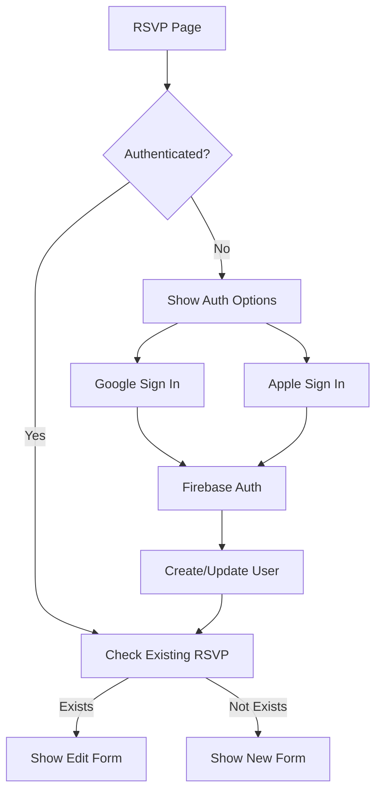

# Wedding Website Implementation Plan
## Enrique & Manuel - May 30, 2025

---

## 1. Technical Architecture Review

### Technical Decisions & Clarifications

#### Confirmed Stack
- **Framework**: Next.js 15.4.4 (App Router)
- **Styling**: TailwindCSS 4 with @theme directive
- **Typography**: Custom system with Trajan Pro 3 & Gotham
- **Auth**: Firebase Auth (Google & Apple)
- **Database**: Google Sheets API for RSVP storage
- **Deployment**: Vercel (recommended for Next.js)

#### Required Dependencies
```json
{
  "dependencies": {
    // Existing
    "firebase": "^12.0.0",
    "next": "15.4.4",
    "react": "19.1.0",
    "react-dom": "19.1.0",
    
    // To be added
    "framer-motion": "^11.0.0",          // Animations
    "react-hook-form": "^7.48.0",        // Form management
    "zod": "^3.22.0",                    // Form validation
    "next-intl": "^3.5.0",               // Internationalization
    "googleapis": "^128.0.0",            // Google Sheets
    "react-intersection-observer": "^9.5.0", // Scroll animations
    "clsx": "^2.1.0",                    // Class utilities
    "react-confetti": "^6.1.0",          // Celebration effects
    "sharp": "^0.33.0"                   // Image optimization
  }
}
```

#### API Structure
```
/api
├── /auth
│   ├── /login         # POST - Firebase auth initiation
│   ├── /logout        # POST - Session termination
│   └── /session       # GET - Validate current session
├── /rsvp
│   ├── /submit        # POST/PUT - Submit or update RSVP
│   ├── /check         # GET - Check existing RSVP
│   └── /guest-lookup  # GET - Find guest by email
└── /sheets
    └── /sync          # POST - Sync with Google Sheets
```

### Optimal Folder Structure
```
/src
├── /app
│   ├── /[locale]
│   │   ├── layout.tsx
│   │   ├── page.tsx
│   │   └── /rsvp
│   │       ├── layout.tsx
│   │       ├── page.tsx
│   │       └── /confirmation
│   │           └── page.tsx
│   ├── /api
│   │   └── (routes as above)
│   └── globals.css
├── /components
│   ├── /sections
│   │   ├── Hero.tsx
│   │   ├── EventTimeline.tsx
│   │   ├── TravelGuide.tsx
│   │   ├── Accommodations.tsx
│   │   ├── DressCode.tsx
│   │   ├── FAQ.tsx
│   │   └── Contact.tsx
│   ├── /rsvp
│   │   ├── RSVPAuth.tsx
│   │   ├── RSVPForm.tsx
│   │   ├── FormSteps/
│   │   └── ConfirmationView.tsx
│   ├── /ui
│   │   ├── Button.tsx
│   │   ├── Card.tsx
│   │   ├── Input.tsx
│   │   └── Modal.tsx
│   ├── /decorative
│   │   ├── FloralBorder.tsx
│   │   ├── WavePattern.tsx
│   │   ├── TropicalLeaf.tsx
│   │   └── MuralBackground.tsx
│   └── /layout
│       ├── Navigation.tsx
│       ├── Footer.tsx
│       └── ScrollProgress.tsx
├── /lib
│   ├── firebase.ts
│   ├── typography.ts
│   ├── sheets.ts
│   ├── animations.ts
│   └── /hooks
│       ├── useAuth.ts
│       ├── useRSVP.ts
│       └── useScrollAnimation.ts
├── /content
│   ├── wedding-content.json
│   └── translations/
│       ├── en.json
│       └── es.json
├── /public
│   ├── /images
│   ├── /illustrations
│   └── /fonts
└── /styles
    ├── animations.css
    └── mural-effects.css
```

---

## 2. Implementation Phases Breakdown

### Phase 1: Foundation & Design System (Week 1)
**Complexity: Medium**

1. **Setup Design Tokens** (Simple)
   - Implement color palette as CSS variables
   - Create spacing and sizing scales
   - Setup responsive breakpoints

2. **Create Mural Background System** (Complex)
   - Build layered SVG components for tropical elements
   - Implement parallax scrolling effects
   - Create reusable decorative components
   - Add noise/texture overlays for painted effect

3. **Implement Navigation** (Medium)
   - Mobile hamburger with smooth drawer
   - Desktop fixed header with scroll behavior
   - Active section indicators
   - Language switcher

4. **Setup Internationalization** (Medium)
   - Configure next-intl
   - Create translation files structure
   - Build language context provider

### Phase 2: Content Sections (Week 2)
**Complexity: Medium**

1. **Hero Section** (Medium)
   - Fullscreen mural background
   - Animated text reveals
   - Scroll indicator animation
   - Responsive scaling

2. **Event Timeline** (Complex)
   - Interactive timeline component
   - Event cards with expand/collapse
   - Map integration for venues
   - Mobile/desktop layout variations

3. **Travel & Accommodations** (Medium)
   - Collapsible travel options
   - Hotel/accommodation cards grid
   - Interactive route selector
   - Booking links integration

4. **Supporting Sections** (Simple)
   - Dress code with weather info
   - FAQ accordion component
   - Contact information
   - Gift registry section

### Phase 3: RSVP System (Week 3)
**Complexity: Complex**

1. **Authentication Flow** (Complex)
   - Firebase Auth integration
   - Protected route setup
   - Session management
   - Guest lookup system

2. **Multi-Step Form** (Complex)
   - Form state management with react-hook-form
   - Step progress indicator
   - Form validation with Zod
   - Local storage for draft saving

3. **Google Sheets Integration** (Medium)
   - Service account setup
   - API endpoint creation
   - Data sync functionality
   - Error handling

4. **Confirmation & Email** (Medium)
   - Success animations
   - Confirmation page design
   - Email notification setup
   - Edit RSVP capability

### Phase 4: Polish & Animation (Week 4)
**Complexity: Medium**

1. **Scroll Animations** (Medium)
   - Intersection Observer setup
   - Staggered reveal animations
   - Parallax effects refinement
   - Performance optimization

2. **Interactive Elements** (Simple)
   - Hover states and micro-interactions
   - Loading states
   - Error boundaries
   - 404 page design

3. **Performance Optimization** (Medium)
   - Image optimization with Sharp
   - Code splitting
   - Font loading optimization
   - Lighthouse audit fixes

### Phase 5: Testing & Launch (Week 5)
**Complexity: Simple**

1. **Cross-Browser Testing**
2. **Mobile Device Testing**
3. **Accessibility Audit**
4. **Performance Testing**
5. **Deployment Setup**

---

## 3. Design System Setup

### White Lotus Mural Aesthetic Implementation

#### Layer Structure
```typescript
// Mural composition layers (back to front)
1. Base gradient background (ocean to sand)
2. Watercolor texture overlay (30% opacity)
3. Background flora (large monstera, palms)
4. Mid-ground marine elements (coral, seaweed)
5. Foreground decorative borders
6. Content layer with subtle shadows
7. Animated floating elements (parallax)
```

#### Painted/Vintage Effects
- CSS filters: `sepia(10%) saturate(0.8) hue-rotate(10deg)`
- Noise texture overlay using SVG filters
- Watercolor brush stroke borders
- Slightly desaturated color palette
- Blend modes for layering effects

#### Required Unsplash Images
```javascript
const imageQueries = {
  hero: "tropical watercolor painting vintage",
  flora: [
    "monstera leaf watercolor",
    "palm frond illustration vintage",
    "bird of paradise flower painting"
  ],
  marine: [
    "coral reef watercolor",
    "seaweed botanical illustration",
    "tropical fish vintage drawing"
  ],
  venues: [
    "tarifa beach sunset spain",
    "mediterranean coastal restaurant",
    "beach wedding setup minimal"
  ],
  textures: [
    "watercolor paper texture",
    "vintage paper background",
    "painted canvas texture"
  ]
};
```

#### Reusable Decorative Components
```typescript
// Component library
<FloralCorner position="top-left" />
<WavePattern height="120px" />
<TropicalFrame>content</TropicalFrame>
<MuralBackground layers={['coral', 'monstera']} />
<AnimatedLeaf delay={200} />
<OrnamentalDivider style="art-nouveau" />
```

---

## 4. Content Management

### JSON Structure (converted from YAML)
```json
{
  "meta": {
    "title": {
      "en": "Enrique & Manuel - May 30, 2025",
      "es": "Enrique & Manuel - 30 de Mayo, 2025"
    },
    "description": {
      "en": "Join us for our beach wedding celebration in Tarifa",
      "es": "Únete a nuestra celebración de boda en la playa de Tarifa"
    },
    "ogImage": "/images/og-wedding.jpg"
  },
  "hero": {
    "greeting": {
      "en": "We are getting married!",
      "es": "¡Nos casamos!"
    },
    "names": "Enrique & Manuel",
    "date": "2025-05-30",
    "location": {
      "en": "Tarifa, Spain",
      "es": "Tarifa, España"
    }
  },
  "events": [
    {
      "id": "early-welcome",
      "type": "welcome",
      "date": "2025-05-29",
      "time": "15:00",
      "title": {
        "en": "Early Welcome",
        "es": "Bienvenida Anticipada"
      },
      "venue": {
        "name": "Chiringuito Tumbao",
        "address": "11380 Valdevaqueros, Cádiz",
        "coordinates": { "lat": 36.065928, "lng": -5.684484 },
        "mapUrl": "https://maps.app.goo.gl/...",
        "website": "https://www.tumbaotarifa.com"
      }
    }
    // ... other events
  ],
  "rsvp": {
    "questions": [
      {
        "id": "attendance",
        "type": "multiselect",
        "required": true,
        "label": {
          "en": "Which events will you attend?",
          "es": "¿A qué eventos asistirás?"
        }
      }
      // ... other questions
    ]
  }
}
```

### TypeScript Interfaces
```typescript
// types/content.ts
export interface WeddingContent {
  meta: MetaContent;
  hero: HeroContent;
  events: WeddingEvent[];
  travel: TravelInfo;
  accommodations: Accommodation[];
  dressCode: DressCodeInfo;
  rsvp: RSVPConfig;
  faq: FAQItem[];
  contact: ContactInfo;
}

export interface WeddingEvent {
  id: string;
  type: 'welcome' | 'pre-wedding' | 'ceremony' | 'celebration' | 'post-wedding';
  date: string;
  time: string;
  title: LocalizedString;
  description?: LocalizedString;
  venue: Venue;
  attire?: LocalizedString;
}

export interface LocalizedString {
  en: string;
  es: string;
}
```

---

## 5. Component Architecture

### Hero Section
```typescript
interface HeroProps {
  content: HeroContent;
  locale: 'en' | 'es';
}

// State requirements
- Scroll position for parallax
- Text animation triggers
- Loading state for background images

// Responsive behavior
- Mobile: Single column, reduced parallax
- Tablet: Increased spacing, partial parallax
- Desktop: Full parallax, larger typography

// Animations
- Text fade-in with stagger (0.2s delay)
- Background layer parallax (0.1-0.5 speed)
- Scroll indicator bounce
- Initial load reveal sequence

// Accessibility
- Reduced motion: disable parallax
- High contrast: increase text shadows
- Screen reader: descriptive aria-labels
- Keyboard: skip to content link
```

### Event Timeline
```typescript
interface TimelineProps {
  events: WeddingEvent[];
  locale: 'en' | 'es';
}

// State requirements
- Active event indicator
- Expanded card states
- Map loading states
- Animation triggers

// Responsive behavior
- Mobile: Vertical timeline, full-width cards
- Tablet: Offset timeline, 80% width cards
- Desktop: Alternating sides, 50% width cards

// Animations
- Card slide-in on scroll
- Hover: subtle scale and shadow
- Click: smooth expand with content reveal
- Timeline line draw animation
```

### RSVP Form
```typescript
interface RSVPFormProps {
  user: AuthUser;
  existingResponse?: RSVPData;
  onSubmit: (data: RSVPData) => Promise<void>;
}

// State requirements
- Current step (1-5)
- Form data across steps
- Validation errors
- Submission status
- Draft auto-save

// Responsive behavior
- Mobile: Full screen steps
- Tablet: Centered modal (80% width)
- Desktop: Centered modal (600px max)

// Animations
- Step transitions (slide)
- Progress bar fill
- Success confetti
- Error shake
```

---

## 6. RSVP System Architecture

### Authentication Flow


### Form State Management
```typescript
// Using react-hook-form with Zod validation
const formSchema = z.object({
  attendance: z.object({
    ceremony: z.boolean(),
    preWedding: z.boolean(),
    postWedding: z.boolean(),
  }),
  guestCount: z.number().min(1).max(5),
  guestNames: z.array(z.string()).min(1),
  dietary: z.array(z.string()),
  transportation: z.boolean(),
  message: z.string().optional(),
  seatingPreference: z.string().optional(),
});

// Form state persistence
const saveFormDraft = (data: Partial<FormData>) => {
  localStorage.setItem('rsvp-draft', JSON.stringify(data));
};
```

### Google Sheets Integration
```typescript
// Service account authentication
const auth = new google.auth.GoogleAuth({
  credentials: serviceAccountKey,
  scopes: ['https://www.googleapis.com/auth/spreadsheets'],
});

// Data structure
const appendToSheet = async (data: RSVPData) => {
  const sheets = google.sheets({ version: 'v4', auth });
  await sheets.spreadsheets.values.append({
    spreadsheetId: process.env.GOOGLE_SHEET_ID,
    range: 'RSVP!A:N',
    valueInputOption: 'USER_ENTERED',
    requestBody: {
      values: [[
        new Date().toISOString(),
        data.email,
        data.name,
        // ... other fields
      ]],
    },
  });
};
```

### API Endpoints Design
```typescript
// /api/rsvp/submit
export async function POST(request: Request) {
  const session = await getServerSession();
  if (!session) return unauthorized();
  
  const data = await request.json();
  const validated = formSchema.parse(data);
  
  // Save to Sheets
  await appendToSheet(validated);
  
  // Send confirmation email
  await sendConfirmationEmail(session.user.email, validated);
  
  return Response.json({ success: true, id: rsvpId });
}
```

---

## 7. Development Priorities

### Week 1 Priority: Visual Foundation
1. **Hero Section** - Immediate visual impact
2. **Navigation** - Core user experience
3. **Mural Background System** - Establishes aesthetic
4. **Typography Integration** - Consistent styling

### Week 2 Priority: Content & Information
1. **Event Timeline** - Critical guest information
2. **JSON Content System** - Enables parallel content work
3. **Travel Section** - Important for planning guests
4. **Mobile Responsiveness** - Ensures accessibility

### Week 3 Priority: Functionality
1. **Firebase Auth** - Blocks RSVP development
2. **RSVP Form Flow** - Core feature
3. **Google Sheets Setup** - Data collection
4. **Form Validation** - User experience

### Week 4 Priority: Polish
1. **Animations** - Delightful experience
2. **Loading States** - Professional feel
3. **Error Handling** - Robustness
4. **Performance** - Fast loading

### Parallel Development Opportunities
- **Design Team**: Create SVG illustrations while dev builds components
- **Content Team**: Populate JSON files while structure is built
- **QA Team**: Test responsive behavior as sections complete

---

## Quick Start Commands

```bash
# Install new dependencies
npm install framer-motion react-hook-form zod next-intl googleapis react-intersection-observer clsx react-confetti sharp

# Create folder structure
mkdir -p src/components/{sections,rsvp,ui,decorative,layout}
mkdir -p src/lib/hooks
mkdir -p src/content/translations
mkdir -p src/app/[locale]/rsvp/confirmation
mkdir -p src/app/api/{auth,rsvp,sheets}
mkdir -p public/{images,illustrations}
mkdir -p src/styles

# Start development
npm run dev
```

---

## Next Steps
1. Create the folder structure
2. Convert YAML content to JSON
3. Implement the Hero section as proof of concept
4. Setup the mural background system
5. Configure internationalization